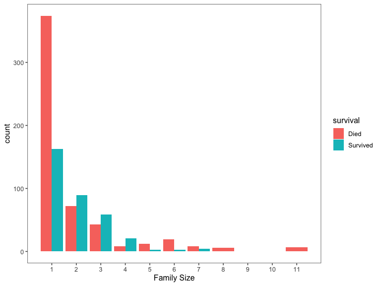
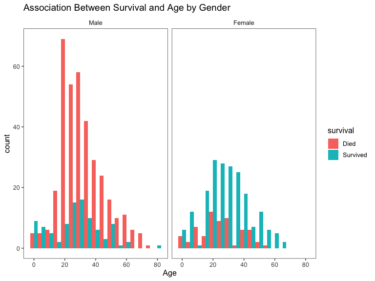
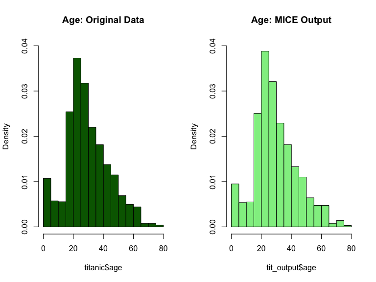

Titanic Project
================
Clement Mugenzi
9/20/2019

# Introduction

This titanic project is based on the infamous sinking of Titanic in
1912, a tragedy that led to `1,502` people dying out of `2,224`
passengers. Datasets provided include the train dataset with `891`
passengers whose survival fate is known and a test dataset with `418`
passengers whose survival fate is unknown. I will first start by loading
both datasets then combine them to do some feature engineering (data
cleaning and data manipulation) then use machine learning tools to
predict what the survival fate for the passengers in the test dataset
would have been.

## Loading the Dataset

``` r
# First, we will load the train dataset.
train = 
  read_csv("Data/train.csv") %>% 
  janitor::clean_names() 
# Second, the test dataset is loaded
test = 
  read_csv("Data/test.csv") %>% 
  janitor::clean_names()
# Then both the train and test datasets are combined into a single dataset.
Titanic = 
  bind_rows(train, test) %>% 
  rename(gender = "sex")
```

After loading and combining both datasets, it is better to highlight
what kind of dataset I will be working with.

Some of the variables important to highlight include name, passengerID,
gender, age, and each individual’s survival status.

# Feature Engineering

## Summary of missing values

The code chunk below summarises how many missing values we have per
column.

``` r
  Titanic %>%
    gather(key = "key", value = "val") %>%
    mutate(is.missing = is.na(val)) %>%
    group_by(key, is.missing) %>%
    summarise(num.missing = n()) %>%
    filter(is.missing == T) %>%
    select(-is.missing) %>%
    arrange(desc(num.missing)) %>%
    rename("Missing Values" = "num.missing", "Variable" = "key") %>% 
  knitr::kable()
```

| Variable | Missing Values |
| :------- | -------------: |
| cabin    |           1014 |
| survived |            418 |
| age      |            263 |
| embarked |              2 |
| fare     |              1 |

We will not worry about the survived variable since all missing values
correspond to the value we are trying to predict, which is the survival
fate of persons in the test dataset.

## Defining Factor Variables

The code chunk below converts appropriate variables to factor variables.

``` r
titanic =
  Titanic %>% 
  mutate(
    survived = recode(survived, "0" = "Died", "1" = "Survived"),
    embarked = recode(embarked, "C" = "Cherbourg", "S" = "Southampton",
                      "Q" = "Queenstown"),
    pclass = recode(pclass, "1" = "1st", "2" = "2nd", "3" = "3rd"),
    gender = factor(gender, levels = c("male", "female")),
    survived = factor(survived, levels = c("Died", "Survived")),
    embarked = factor(embarked, levels = c("Cherbourg", "Southampton",
                                           "Queenstown")),
    pclass = factor(pclass, levels = c("1st", "2nd", "3rd")))
```

This is a dirty dataset and we either need to drop the rows with NaN
values or fill in the gaps by leveraging the data in the dataset to
estimate what those values could have been. We will choose the latter
and try to estimate those values and fill in the gaps rather than lose
observations.

## Creating a Family Variable

We all know that family usually have the same last name, therefore I
will group families according to their last names to make it easier to
create the family variable.

``` r
# Finally, grab surname from passenger name
titanic$lastname = sapply(titanic$name,  
                      function(x) strsplit(x, split = '[,.]')[[1]][1])
```

Since we have variables quantifying the number of family members present
for a particular passenger, I will use those to create a brand new
`Family` variable which can help us measure the likelihood a passenger
will survive given the amount of family members they have on board with
them (since family members usually have a tendency to not leave their
people behind).

``` r
# Creating a Family variable including the passenger themselves.
titanic$famsize = titanic$sib_sp + titanic$parch + 1

# Creating a Family variable
titanic$family = paste(titanic$lastname, titanic$famsize, sep = "_")
```

Thus, using the above created `Family` variable, I can visualize the
association between family size and survival of a passenger. Note that
the largest family was composed of **11**
people.

``` r
# Use ggplot2 to visualize the relationship between family size & survival
ggplot(titanic[1:891,], aes(x = famsize, fill = factor(survived))) +
  geom_bar(stat = 'count', position = 'dodge') +
  scale_x_continuous(breaks = c(1:11)) +
  labs(x = 'Family Size') +
  theme_few()
```



And as expected, the larger the family gets the less likely it becomes
for an individual to survive.

We can also visualize the relationship between `Age` and `Survival`

``` r
# We'll look at the relationship between age & survival by gender.
ggplot(titanic[1:891,], aes(age, fill = survived)) + 
  geom_histogram() + 
  facet_grid(.~gender) + 
  labs(
    title = "Association Between Survival and Age when Gender is factored in",
    x = "Age") +
  theme_few()
```

    ## `stat_bin()` using `bins = 30`. Pick better value with `binwidth`.



A lot is happening here, but it is clear that the `Female` sex was
unlikely to survive especially for female aged between 20-40 years old.
This can be due to a lot of factors such as that mothers might have been
more vulnerable because they were caring for their children, so they
were more likely to die. On the male side, it is understandable that
males aged `20-40` were more likely to survive compared to males in
other age groups.

## Cleaning Names

With the following code chunk, we will determine what different name
titles we have and their distribution according to gender.

``` r
# I will extract titles from the name variable
titanic$titles = gsub('(.*, )|(\\..*)', '', titanic$name)
table(titanic$gender, titanic$titles) %>% 
  knitr::kable()
```

|        | Capt | Col | Don | Dona | Dr | Jonkheer | Lady | Major | Master | Miss | Mlle | Mme |  Mr | Mrs | Ms | Rev | Sir | the Countess |
| ------ | ---: | --: | --: | ---: | -: | -------: | ---: | ----: | -----: | ---: | ---: | --: | --: | --: | -: | --: | --: | -----------: |
| male   |    1 |   4 |   1 |    0 |  7 |        1 |    0 |     2 |     61 |    0 |    0 |   0 | 757 |   0 |  0 |   8 |   1 |            0 |
| female |    0 |   0 |   0 |    1 |  1 |        0 |    1 |     0 |      0 |  260 |    2 |   1 |   0 | 197 |  2 |   0 |   0 |            1 |

Let’s now define all these different name titles as rare titles (for
those titles which are really rare).

### Distribution of Titles by Gender

``` r
# Titles with very low cell counts to be combined to "rare" level
rare_title <- c('Dona', 'Lady', 'the Countess','Capt', 'Col', 'Don', 
                'Dr', 'Major', 'Rev', 'Sir', 'Jonkheer')


# Also reassign mlle, ms, and mme accordingly
titanic = 
  titanic %>%
  mutate(
    titles = gsub('(.*, )|(\\..*)', '', titanic$name),
    titles = str_replace(titles, "Mlle", "Miss"),
    titles = str_replace(titles, "Ms", "Miss"),
    titles = str_replace(titles, "Mme", "Mrs"),
    titles = recode(titles, "Dona" = "Rare Title", "Lady" = "Rare Title",
                   "the Countess" = "Rare Title", "Capt" = "Rare Title",
                   "Col" = "Rare Title", "Don" = "Rare Title",
                   "Dr" = "Rare Title", "Major" = "Rare Title",
                   "Rev" = "Rare Title", "Sir" = "Rare Title",
                   "Jonkheer" = "Rare Title"))
titanic %>% 
  group_by(titles, gender) %>% 
  summarise(
    Frequency = n()) %>% 
  pivot_wider(
    names_from = titles,
    values_from = Frequency) %>%
  mutate(
    Master = replace_na(Master, 0),
    Miss = replace_na(Miss, 0),
    Mr = replace_na(Mr, 0),
    Mrs = replace_na(Mrs, 0)) %>% 
  knitr::kable()
```

| gender | Master | Miss |  Mr | Mrs | Rare Title |
| :----- | -----: | ---: | --: | --: | ---------: |
| male   |     61 |    0 | 757 |   0 |         25 |
| female |      0 |  264 |   0 | 198 |          4 |

``` r
titanic %>% 
  group_by(gender, pclass, titles) %>% 
  summarise(
    median_age = median(age, na.rm = T)) %>% 
  knitr::kable()
```

| gender | pclass | titles     | median\_age |
| :----- | :----- | :--------- | ----------: |
| male   | 1st    | Master     |         6.0 |
| male   | 1st    | Mr         |        41.5 |
| male   | 1st    | Rare Title |        49.5 |
| male   | 2nd    | Master     |         2.0 |
| male   | 2nd    | Mr         |        30.0 |
| male   | 2nd    | Rare Title |        41.5 |
| male   | 3rd    | Master     |         6.0 |
| male   | 3rd    | Mr         |        26.0 |
| female | 1st    | Miss       |        30.0 |
| female | 1st    | Mrs        |        45.0 |
| female | 1st    | Rare Title |        43.5 |
| female | 2nd    | Miss       |        20.0 |
| female | 2nd    | Mrs        |        30.5 |
| female | 3rd    | Miss       |        18.0 |
| female | 3rd    | Mrs        |        31.0 |

The table above gives us a short summary of how we should go about
replacing all the missing age values. And as expected, those passengers
with title name **Master** or **Mrs** tend to be younger than those with
title names **Mrs** or **Mr.** It also looks like there is an age
variability among passenger class (Pclass) where older passengers seem
tend to be in the more luxurious 1st class.

## Creating a mother and status Variable

To make it more interesting, I am going to create a `mother` and
`status` variable to see whether being a mother or child is associated
to survival.

``` r
# Create the column status, and indicate whether child or adult
titanic$status[titanic$age < 18] = "Child"
titanic$status[titanic$age >= 18] = "Adult"

# Show counts
table(titanic$status, titanic$survived)
```

    ##        
    ##         Died Survived
    ##   Adult  372      229
    ##   Child   52       61

Next, let us create the `mother` variable.

``` r
# Adding Mother variable
titanic$mother = 'Not Mother'
titanic$mother[
  titanic$gender == 'female' & titanic$parch > 0 
  & titanic$age > 18 & titanic$titles != 'Miss'] = 'Mother'

# Show counts
table(titanic$mother, titanic$survived)
```

    ##             
    ##              Died Survived
    ##   Mother       15       37
    ##   Not Mother  534      305

Now let us convert both variables created in factor variables

``` r
titanic = 
  titanic %>% 
  mutate(
    status = factor(status, levels = c("Adult", "Child")),
    mother = factor(mother, levels = c("Not Mother", "Mother")))
```

# Missingness

## The Age variable

There are **263** missing age values. We will use a technique of
replacing the missing age values using a model that predicts age based
on other variables. I will use the **Multivariate Imputation by Chained
Equations (Mice)** package to predict what missing age values would have
been based on other variables.

``` r
set.seed(129)
tit_mod = mice(titanic[, !names(titanic) %in% c("passenger_id","name","ticket","cabin","titles","survived")], 
                 method = "rf") 
```

    ## 
    ##  iter imp variable
    ##   1   1  age  fare  embarked  status
    ##   1   2  age  fare  embarked  status
    ##   1   3  age  fare  embarked  status
    ##   1   4  age  fare  embarked  status
    ##   1   5  age  fare  embarked  status
    ##   2   1  age  fare  embarked  status
    ##   2   2  age  fare  embarked  status
    ##   2   3  age  fare  embarked  status
    ##   2   4  age  fare  embarked  status
    ##   2   5  age  fare  embarked  status
    ##   3   1  age  fare  embarked  status
    ##   3   2  age  fare  embarked  status
    ##   3   3  age  fare  embarked  status
    ##   3   4  age  fare  embarked  status
    ##   3   5  age  fare  embarked  status
    ##   4   1  age  fare  embarked  status
    ##   4   2  age  fare  embarked  status
    ##   4   3  age  fare  embarked  status
    ##   4   4  age  fare  embarked  status
    ##   4   5  age  fare  embarked  status
    ##   5   1  age  fare  embarked  status
    ##   5   2  age  fare  embarked  status
    ##   5   3  age  fare  embarked  status
    ##   5   4  age  fare  embarked  status
    ##   5   5  age  fare  embarked  status

``` r
tit_output = complete(tit_mod)
```

After running this mice model, I am worried that it might have
compromised my original titanic dataset. So let use some visualization
to see if nothing changed.

``` r
par(mfrow = c(1,2))
hist(titanic$age, freq = F, main = 'Age: Original Data', 
  col = 'darkgreen', ylim = c(0,0.04))
hist(tit_output$age, freq = F, main = 'Age: MICE Output', 
  col = 'lightgreen', ylim = c(0,0.04))
```



Now that everything looks good, let us replace all the missing age
values using the mice model I just built.

``` r
titanic$age = tit_output$age
sum(is.na(titanic$age))
```

    ## [1] 0

## The Cabin variable

With cabin having a total of 1014 missing values, I will just replace
all of them with letter **U** which stands for **Unknown.**

``` r
titanic$cabin = replace_na("U")
sum(is.na(titanic$cabin))
```

    ## [1] 0

## The Embarked variable

Here, I will just replace the 2 missing values based on on the amount of
money they paid to embark (fare variable). We can easily visualize this
by plotting the embarked, fare, and passenger class (Pclass) variables
on the boxplot.

``` r
# Get rid of our missing passenger IDs
embark_fare = titanic %>%
  filter(passenger_id != 62 & passenger_id != 830)

# Use ggplot2 to visualize embarkment, passenger class, & median fare
ggplot(embark_fare, aes(x = embarked, y = fare, fill = factor(pclass))) +
  geom_boxplot() +
  geom_hline(aes(yintercept = 80), 
    colour = "red", linetype = "dashed", lwd = 2) +
  scale_y_continuous(labels = dollar_format()) +
  theme_few()
```


Therefore, looking at the plot, we can safely conclude that both
passengers embarked from the **Cherbourg** port, so I will replace both
missing values with the corresponding port of embarkment.

``` r
titanic$embarked[c(62, 830)] = 'Cherbourg'
sum(is.na(titanic$embarked))
```

    ## [1] 0

## The Fare variable

``` r
ggplot(titanic[titanic$pclass == "3rd" & titanic$embarked == "Southampton", ], 
  aes(x = fare)) +
  geom_density(fill = "gray50", alpha = 0.4) + 
  geom_vline(aes(xintercept = median(fare, na.rm = T)),
    colour = 'black', linetype = "dashed", lwd = 1) +
  scale_x_continuous(labels = dollar_format()) +
  labs(
    title = "Distribution of Payment",
    x = "Fare") +
  theme_few()
```


Therefore, I will replace the missing value with the median of the
**3rd** passenger class.

``` r
titanic$fare[1044] = 
  median(titanic[titanic$pclass == "3rd" & titanic$embarked == "Southampton", ]$fare, 
         na.rm = TRUE)
sum(is.na(titanic$fare))
```

    ## [1] 0
