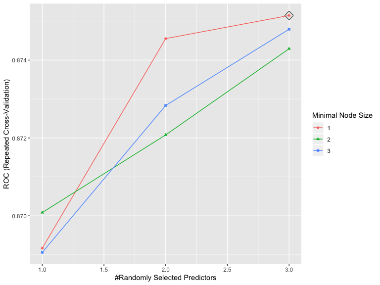
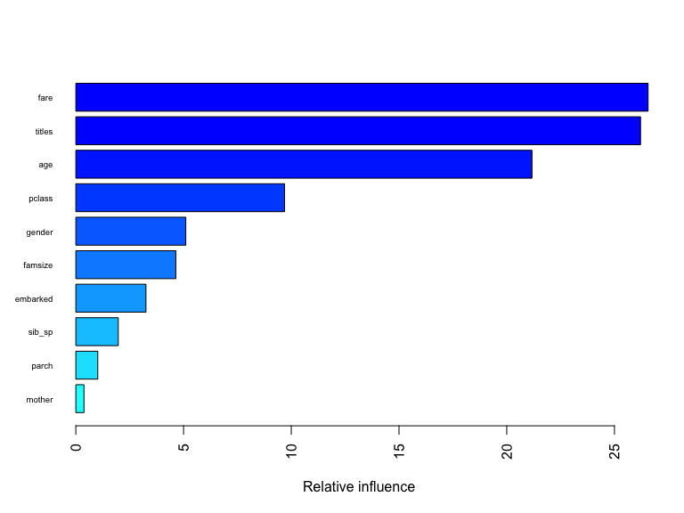
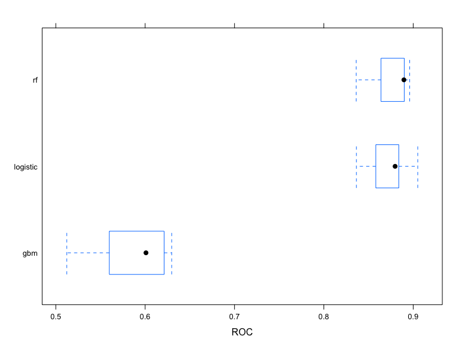

Titanic Project
================
Clement Mugenzi
9/20/2019

# Introduction

This titanic project is based on the infamous sinking of Titanic in
1912, a tragedy that led to `1,502` people dying out of `2,224`
passengers. Datasets provided include the train dataset with `891`
passengers whose survival fate is known and a test dataset with `418`
passengers whose survival fate is unknown. I will first start by loading
both datasets then combine them to do some feature engineering then use
machine learning tools to predict what the survival fate for the
passengers in the test dataset would have been.

## Loading the Dataset

``` r
# First, we will load the train dataset.
f_train = 
  read_csv("Data/train.csv") %>% 
  janitor::clean_names() 
# Second, the test dataset is loaded
f_test = 
  read_csv("Data/test.csv") %>% 
  janitor::clean_names()
# Then both the train and test datasets are combined into a single dataset.
Titanic = 
  bind_rows(f_train, f_test) %>% 
  rename(gender = "sex")
```

After loading and combining both datasets, it is better to highlight
what kind of dataset I will be working with.

Some of the variables important to highlight include name, passengerID,
gender, age, and each individual’s survival status.

# Feature Engineering

## Summary of missing values

The code chunk below summarises how many missing values we have per
column.

``` r
  Titanic %>%
    gather(key = "key", value = "val") %>%
    mutate(is.missing = is.na(val)) %>%
    group_by(key, is.missing) %>%
    summarise(num.missing = n()) %>%
    filter(is.missing == T) %>%
    select(-is.missing) %>%
    arrange(desc(num.missing)) %>%
    rename("Missing Values" = "num.missing", "Variable" = "key") %>% 
  knitr::kable()
```

| Variable | Missing Values |
| :------- | -------------: |
| cabin    |           1014 |
| survived |            418 |
| age      |            263 |
| embarked |              2 |
| fare     |              1 |

We will not worry about the survived variable since all missing values
correspond to the value we are trying to predict, which is the survival
fate of persons in the test dataset.

## Defining Factor Variables

The code chunk below converts appropriate variables to factor variables.
With cabin having a total of multiple missing values, I will just
replace all of them with letter **U** which stands for **Unknown**.

``` r
titanic =
  Titanic %>%
  rename(survival = survived) %>%
  mutate(
    gender = recode(gender, "male" = "Male", "female" = "Female"),
    embarked = recode(embarked, "C" = "Cherbourg", "S" = "Southampton",
                      "Q" = "Queenstown"),
    pclass = recode(pclass, "1" = "1st", "2" = "2nd", "3" = "3rd"),
    survival = recode(survival, "0" = "Died", "1" = "Survived"),
    cabin = replace_na(cabin, "U"),
    gender = factor(gender, levels = c("Male", "Female")),
    embarked = factor(embarked, levels = c("Cherbourg", "Southampton",
                                           "Queenstown")),
    survival = factor(survival, levels = c("Died", "Survived")),
    pclass = factor(pclass, levels = c("1st", "2nd", "3rd")))
```

This is a dirty dataset and we either need to drop the rows with NaN
values or fill in the gaps by leveraging the data in the dataset to
estimate what those values could have been. We will choose the latter
and try to estimate those values and fill in the gaps rather than lose
observations.

## Creating a Family Variable

We all know that family usually have the same last name, therefore I
will group families according to their last names to make it easier to
create the family variable.

``` r
# Finally, grab surname from passenger name
titanic$lastname = sapply(titanic$name,  
                      function(x) strsplit(x, split = '[,.]')[[1]][1])
```

Since we have variables quantifying the number of family members present
for a particular passenger, I will use those to create a brand new
`Family` variable which can help us measure the likelihood a passenger
will survive given the amount of family members they have on board with
them (since family members usually have a tendency to not leave their
people behind).

``` r
# Creating a Family variable including the passenger themselves.
titanic$famsize = titanic$sib_sp + titanic$parch + 1

# Creating a Family variable
titanic$family = paste(titanic$lastname, titanic$famsize, sep = "_")
```

Thus, using the above created `Family` variable, I can visualize the
association between family size and survival of a passenger. Note that
the largest family was composed of **11**
people.

``` r
# Use ggplot2 to visualize the relationship between family size & survival
ggplot(titanic[1:891,], aes(x = famsize, fill = survival)) +
  geom_bar(stat = 'count', position = 'dodge') +
  scale_x_continuous(breaks = c(1:11)) +
  labs(x = 'Family Size') +
  theme_few()
```


And as expected, the larger the family gets the less likely an
individual would have survived.

We can also visualize the relationship between `Age` and `Survival`

``` r
# We'll look at the relationship between age & survival by gender.
ggplot(titanic[1:891,], aes(age, fill = survival)) + 
  geom_histogram(position = "dodge", binwidth = 5) + 
  facet_grid(~gender) + 
  labs(
    title = "Association Between Survival and Age by Gender",
    x = "Age") +
  theme_few()
```


It is clear that the `Female` gender was likely to survive especially
for female aged between 20-40 years old. This can be due to a lot of
factors such as that mothers might have been more vulnerable, and thus
were more likely to be rescued along with their young ones. On the male
side, males in the `20-40` age group were more likely to die compared to
males in other age groups because these men might have been involved in
the rescuing other groups such as mothers, their kids, and the elderly.

## Cleaning Names

With the following code chunk, we will determine what different name
titles we have and their distribution according to gender.

``` r
# I will extract titles from the name variable
titanic$titles = gsub('(.*, )|(\\..*)', '', titanic$name)
table(titanic$gender, titanic$titles) %>% 
  knitr::kable()
```

|        | Capt | Col | Don | Dona | Dr | Jonkheer | Lady | Major | Master | Miss | Mlle | Mme |  Mr | Mrs | Ms | Rev | Sir | the Countess |
| ------ | ---: | --: | --: | ---: | -: | -------: | ---: | ----: | -----: | ---: | ---: | --: | --: | --: | -: | --: | --: | -----------: |
| Male   |    1 |   4 |   1 |    0 |  7 |        1 |    0 |     2 |     61 |    0 |    0 |   0 | 757 |   0 |  0 |   8 |   1 |            0 |
| Female |    0 |   0 |   0 |    1 |  1 |        0 |    1 |     0 |      0 |  260 |    2 |   1 |   0 | 197 |  2 |   0 |   0 |            1 |

Let’s now define all these different name titles as rare titles (for
those titles which are really rare).

### Distribution of Titles by Gender

``` r
# Titles with very low cell counts to be combined to "rare" level
rare_title = c('Dona', 'Lady', 'the Countess','Capt', 'Col', 'Don', 
                'Dr', 'Major', 'Rev', 'Sir', 'Jonkheer')


# Also reassign mlle, ms, and mme accordingly
titanic = 
  titanic %>%
  mutate(
    titles = gsub('(.*, )|(\\..*)', '', titanic$name),
    titles = str_replace(titles, "Mlle", "Miss"),
    titles = str_replace(titles, "Ms", "Miss"),
    titles = str_replace(titles, "Mme", "Mrs"),
    titles = recode(titles, "Dona" = "Rare Title", "Lady" = "Rare Title",
                   "the Countess" = "Rare Title", "Capt" = "Rare Title",
                   "Col" = "Rare Title", "Don" = "Rare Title",
                   "Dr" = "Rare Title", "Major" = "Rare Title",
                   "Rev" = "Rare Title", "Sir" = "Rare Title",
                   "Jonkheer" = "Rare Title"))
titanic %>% 
  group_by(titles, gender) %>% 
  summarise(
    Frequency = n()) %>% 
  pivot_wider(
    names_from = titles,
    values_from = Frequency) %>%
  mutate(
    Master = replace_na(Master, 0),
    Miss = replace_na(Miss, 0),
    Mr = replace_na(Mr, 0),
    Mrs = replace_na(Mrs, 0)) %>% 
  knitr::kable()
```

| gender | Master | Miss |  Mr | Mrs | Rare Title |
| :----- | -----: | ---: | --: | --: | ---------: |
| Male   |     61 |    0 | 757 |   0 |         25 |
| Female |      0 |  264 |   0 | 198 |          4 |

``` r
titanic %>% 
  group_by(gender, pclass, titles) %>% 
  summarise(
    median_age = median(age, na.rm = T)) %>% 
  knitr::kable()
```

| gender | pclass | titles     | median\_age |
| :----- | :----- | :--------- | ----------: |
| Male   | 1st    | Master     |         6.0 |
| Male   | 1st    | Mr         |        41.5 |
| Male   | 1st    | Rare Title |        49.5 |
| Male   | 2nd    | Master     |         2.0 |
| Male   | 2nd    | Mr         |        30.0 |
| Male   | 2nd    | Rare Title |        41.5 |
| Male   | 3rd    | Master     |         6.0 |
| Male   | 3rd    | Mr         |        26.0 |
| Female | 1st    | Miss       |        30.0 |
| Female | 1st    | Mrs        |        45.0 |
| Female | 1st    | Rare Title |        43.5 |
| Female | 2nd    | Miss       |        20.0 |
| Female | 2nd    | Mrs        |        30.5 |
| Female | 3rd    | Miss       |        18.0 |
| Female | 3rd    | Mrs        |        31.0 |

The table above gives us a short summary of how we should go about
replacing all the missing age values. And as expected, those passengers
with title name **Master** or **Miss** tend to be younger than those
with title names **Mrs** or **Mr.** It also looks like there is an age
variability among passenger class (Pclass) where older passengers tend
to be in the more luxurious 1st class.

## Creating a mother and status Variable

To make it more interesting, I am going to create a `mother` variable to
see whether being a mother or child is associated with survival.

let us create the `mother` variable.

``` r
# Adding Mother variable
titanic$mother = 'Not Mother'
titanic$mother[
  titanic$gender == 'Female' & titanic$parch > 0 
  & titanic$age > 18 & titanic$titles != 'Miss'] = 'Mother'

# Show counts
table(titanic$mother, titanic$survival)
```

    ##             
    ##              Died Survived
    ##   Mother       15       37
    ##   Not Mother  534      305

Now let us convert both variables created in factor variables

``` r
titanic = 
  titanic %>% 
  mutate(
    mother = factor(mother, levels = c("Not Mother", "Mother")),
    titles = factor(titles, levels = c("Mr", "Mrs", "Miss", "Master",
                                       "Rare Title")))
```

# Missingness

## The Age variable

There are **263** missing age values. We will use a technique of
replacing the missing age values using a model that predicts age based
on other variables. I will use the **Multivariate Imputation by Chained
Equations (Mice)** package to predict what missing age values would have
been based on other variables.

After running this mice model, I am worried that it might have
compromised my original titanic dataset. So let use some visualization
to see if nothing changed.

``` r
par(mfrow = c(1,2))
hist(titanic$age, freq = F, main = 'Age: Original Data', 
  col = 'darkgreen', ylim = c(0,0.04))
hist(tit_output$age, freq = F, main = 'Age: MICE Output', 
  col = 'lightgreen', ylim = c(0,0.04))
```


Now that everything looks good, let us replace all the missing age
values using the mice model I just built.

``` r
titanic$age = tit_output$age
sum(is.na(titanic$age))
```

    ## [1] 0

## The Embarked variable

Here, I will just replace the 2 missing values based on on the amount of
money they paid to embark (fare variable). We can easily visualize this
by plotting the embarked, fare, and passenger class (Pclass) variables
on the boxplot.

``` r
# Get rid of our missing passenger IDs
embark_fare = titanic %>%
  filter(passenger_id != 62 & passenger_id != 830)

# Use ggplot2 to visualize embarkment, passenger class, & median fare
ggplot(embark_fare, aes(x = embarked, y = fare, fill = factor(pclass))) +
  geom_boxplot() +
  geom_hline(aes(yintercept = 80), 
    colour = "red", linetype = "dashed", lwd = 2) +
  scale_y_continuous(labels = dollar_format()) +
  theme_few()
```


Therefore, looking at the plot, we can safely conclude that both
passengers embarked from the **Cherbourg** port, so I will replace both
missing values with the corresponding port of embarkment.

``` r
titanic$embarked[c(62, 830)] = 'Cherbourg'
sum(is.na(titanic$embarked))
```

    ## [1] 0

## The Fare variable

``` r
ggplot(titanic[titanic$pclass == "3rd" & titanic$embarked == "Southampton", ], 
  aes(x = fare)) +
  geom_density(fill = "gray50", alpha = 0.4) + 
  geom_vline(aes(xintercept = median(fare, na.rm = T)),
    colour = 'black', linetype = "dashed", lwd = 1) +
  scale_x_continuous(labels = dollar_format()) +
  labs(
    title = "Distribution of Payment",
    x = "Fare") +
  theme_few()
```


Therefore, I will replace the missing value with the median of the
**3rd** passenger class.

``` r
titanic$fare[1044] = 
  median(titanic[titanic$pclass == "3rd" & titanic$embarked == "Southampton", ]$fare, 
         na.rm = TRUE)
sum(is.na(titanic$fare))
```

    ## [1] 0

After this step, the final `Titanic` dataset should be cleaned without
missing values and necessary variables for the `Prediction` stage.

## Splitting the Dataset for model building

I will split the `Titanic` dataset back to the `Train` and `Test`
datasets.

``` r
titanic = titanic %>%
  select(-c("name", "ticket", "family", "lastname", "cabin"))

# I thought of using caret but it is not possible in this situation due
# to missing values in the test dataset

# splitting the dataset
test_data = titanic[is.na(titanic$survival),]
train_data = na.omit(titanic)
# pull out the dependent variable
train_df = train_data[,-c(1,2)]
test_df = test_data[,-c(1,2)]
```

# Model Building

## Logistic Model

I can also fit a logistic regression using caret. This is to compare the
cross-validation performance with other models, rather than tuning the
model.

``` r
# set up training control
ctrl1 = trainControl(method = "repeatedcv", # 10 fold cross validation
                    number = 5, # do 5 repetition of cv
                    summaryFunction = twoClassSummary, # Use AUC to pick the best model
                    classProbs = TRUE)

set.seed(1)

model.glm = train(x = train_df,
                  y = train_data$survival,
                  method = "glm",
                  metric = "ROC",
                  trControl = ctrl1)
```

## Random Forest Model

Next, I will optimize a randomForest by tunning it first to determine
the right number of trees and number of features to be selected at each
split, the right combination of which will result in the highest model
accuracy.

``` r
# set up training control
ctrl = trainControl(method = "repeatedcv", # 10 fold cross validation
                    number = 5, # do 5 repetition of cv
                    summaryFunction = twoClassSummary, # Use AUC to pick the best model
                    classProbs = TRUE,
                    allowParallel = TRUE)


rf.grid = expand.grid(mtry = 1:3,
                      splitrule = "gini",
                      min.node.size = 1:3)
set.seed(1) # set the seed
rf.fit = train(x = train_df, y = train_data$survival,
                method = "ranger",
                metric = "ROC", # performance criterion to select the best model
                trControl = ctrl,
                tuneGrid = rf.grid,
                verbose = FALSE)
ggplot(rf.fit, highlight = TRUE)
```



``` r
# the besttune
rf.fit$bestTune
```

    ##   mtry splitrule min.node.size
    ## 7    3      gini             1

This randomForest model was tuned and optimized, resulting in the
highest **Accuracy** of 0.8737395 over the optimization range.

**Variable Importance for RandomForest
model:**


This figure shows a graphical representation of the variable importance
in the `titanic` data. We see the mean decrease in Gini index for each
variable, relative to the largest. The variables with the largest mean
decrease in Gini index are `titles`, `fare`, and `gender`.

## Gradient Boosting Model

Finally, I will optimize a Gradient Boosting by tunning it first to
determine the right number of trees, the right depth of those trees, and
the right learning rate since Gradient boosting learns slowlt. The right
combination of which will result in the highest model accuracy.

``` r
# Use the expand.grid to specify the search space
grid = expand.grid(n.trees = c(4000,5000), # number of trees to fit
                        interaction.depth = 2:8, # depth of variable interaction
                        shrinkage = c(0.001, 0.003,0.005), # try 3 values for learning rate
                        n.minobsinnode = 1)

# Boosting model
set.seed(1) # set the seed
gbm.fit = train(x = train_df, y = train_data$survival,
                method = "gbm",
                metric = "ROC", # performance criterion to select the best model
                trControl = ctrl,
                tuneGrid = grid,
                verbose = FALSE)
# variable importance
summary(gbm.fit$finalModel, las = 2, cex.names = 0.6)
```



    ##               var    rel.inf
    ## fare         fare 26.5616014
    ## titles     titles 26.2109654
    ## age           age 21.1721060
    ## pclass     pclass  9.6887440
    ## gender     gender  5.1036894
    ## famsize   famsize  4.6415573
    ## embarked embarked  3.2555406
    ## sib_sp     sib_sp  1.9696483
    ## parch       parch  1.0180282
    ## mother     mother  0.3781194

``` r
# looking at the tuning results
gbm.fit$bestTune
```

    ##    n.trees interaction.depth shrinkage n.minobsinnode
    ## 36    5000                 5     0.005              1

``` r
# plot the performance of the training models
plot(gbm.fit)
```


## Model Selection based on Cross Validation

``` r
resamp = resamples(list(logistic = model.glm, rf = rf.fit, gbm = gbm.fit))
# Visualizing ROC
bwplot(resamp, metric = "ROC")
```



As shown in the boxplot, the RandomForest model is the optimal model
followed by the logistic and Gradient Boosting.

# Prediction

``` r
# Predict using the test set
rf.pred = predict(rf.fit, newdata = test_data, type = "raw")


# Save the solution to a dataframe with two columns: PassengerId and Survived (predicted values)
solution = data.frame(PassengerID = test_data$passenger_id, Survival = rf.pred)

# Write the solution to file
write.csv(solution, file = 'rf_modelPred.csv', row.names = F)
```

# Conclusion

In this classification problem, I optimized a RandomForest and Gradient
Boosting models then compared them to a logistic model, where the
RandomForest proved to be the optimal model with a 87% accuracy. I
approached this problem by conducting feature engineering to leverage
original variables provided to me. I created the `titles` variable from
the `name` variable, which was found to be the most important of all.
Obviously this problem can be approached in different ways, different
models could be used, and certainly different predictor variables could
be created from the existing ones.
