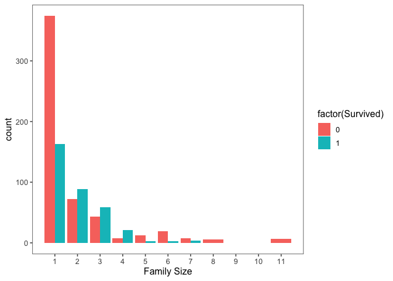
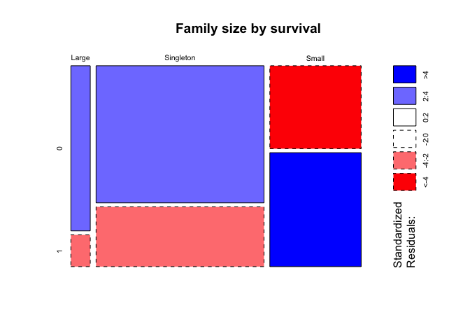

My\_Titanic
================
Clement Mugenzi
9/20/2019

This dataset will be comprised of two separate .csv files, both of which
will be combined then used to predict who survives on the titanic. But
first, let’s load all packages that I will be using in this project.

# Import the Dataset

``` r
# First, we will load the train dataset.
train = read_csv("train.csv")
```

    ## Parsed with column specification:
    ## cols(
    ##   PassengerId = col_double(),
    ##   Survived = col_double(),
    ##   Pclass = col_double(),
    ##   Name = col_character(),
    ##   Sex = col_character(),
    ##   Age = col_double(),
    ##   SibSp = col_double(),
    ##   Parch = col_double(),
    ##   Ticket = col_character(),
    ##   Fare = col_double(),
    ##   Cabin = col_character(),
    ##   Embarked = col_character()
    ## )

``` r
# Second, the test dataset is loaded
test = read_csv("test.csv")
```

    ## Parsed with column specification:
    ## cols(
    ##   PassengerId = col_double(),
    ##   Pclass = col_double(),
    ##   Name = col_character(),
    ##   Sex = col_character(),
    ##   Age = col_double(),
    ##   SibSp = col_double(),
    ##   Parch = col_double(),
    ##   Ticket = col_character(),
    ##   Fare = col_double(),
    ##   Cabin = col_character(),
    ##   Embarked = col_character()
    ## )

``` r
# Then both the train and test datasets are combined into a single dataset.
full = bind_rows(train, test)
```

# Feature Engineering

Titles with very low cell counts to be combined to “rare” level in the
chunk below.

``` r
rare_title <- c("Dona", "Lady", "the Countess",
                "Capt", "Col", "Don", "Dr",
                "Major", "Rev", "Sir", "Jonkheer")
# Also reassign mlle, ms, and mme accordingly
full$Title[full$Title == "Mlle"] = "Miss"
full$Title[full$Title == "Ms"] = "Miss"
full$Title[full$Title == "Mme"] = "Mrs"
full$Title[full$Title %in% rare_title] = "rare_title"
```

Show title counts by sex
again

# Visualization

``` r
# Use ggplot2 to visualize the relationship between family size and survival
ggplot(full[1:891,], aes(x = fsize, fill = factor(Survived))) +
  geom_bar(star = 'Count', position = 'dodge') + scale_x_continuous(breaks = c(1:11)) + labs(x ='Family Size') + theme_few()
```

    ## Warning: Ignoring unknown parameters: star

<!-- -->

``` r
# Let's Discretize family size
full$fsizeD[full$fsize == 1] <- 'Singleton'
```

    ## Warning: Unknown or uninitialised column: 'fsizeD'.

``` r
full$fsizeD[full$fsize < 5 & full$fsize > 1] <- 'Small'
full$fsizeD[full$fsize > 4] <- 'Large'
# Show family size by survival using mosaic plot
mosaicplot(table(full$fsizeD, full$Survived), main = 'Family size by survival', shade = T)
```

<!-- -->
